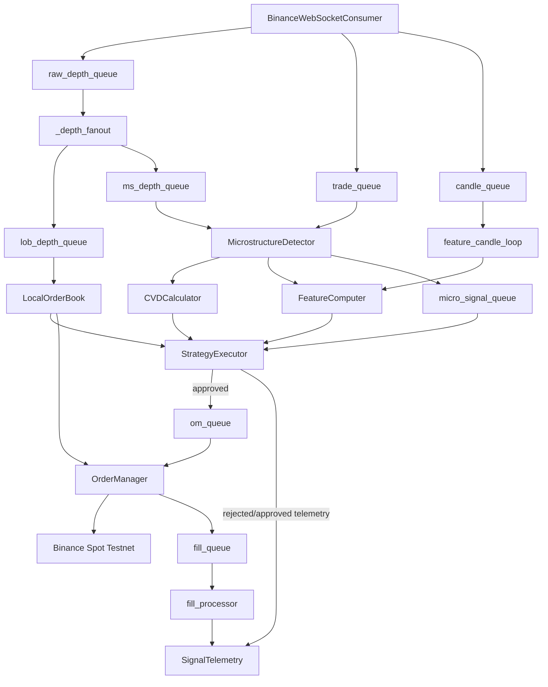
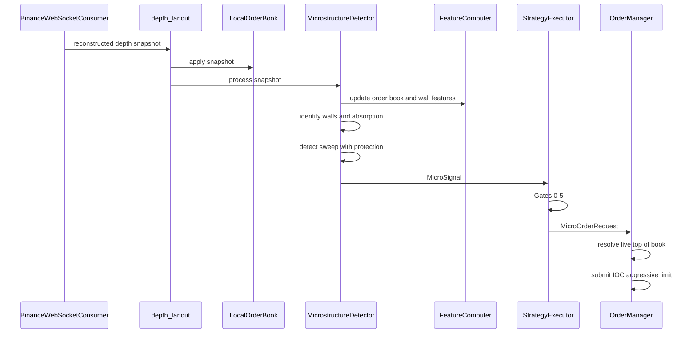

# Trading Algorithm Documentation

CryptoSentinel v3.0 runs a live, event-driven microstructure algorithm for BTCUSDT on Binance Spot Testnet. The algorithm starts from reconstructed limit-order-book ticks, detects level-specific wall interaction, evaluates each candidate through the execution gates, and submits an IOC aggressive limit order only after the live book, confidence, capital, spread, and latency checks pass.

This document focuses on the current live microstructure path. The legacy chart-pattern execution pipeline is disabled in live startup; candle data now feeds `FeatureComputer` directly for model context.

## Algorithm Overview

The live algorithm is organized as an asyncio task graph:

1. `BinanceWebSocketConsumer` receives depth, trade, and candle streams.
2. `_depth_fanout()` sends each reconstructed depth snapshot to both `LocalOrderBook` and `MicrostructureDetector`.
3. `LocalOrderBook` maintains the shared synced book used for top-of-book reads, wall persistence checks, and dashboard snapshots.
4. `_feature_candle_loop()` feeds closed candles into `FeatureComputer`.
5. `MicrostructureDetector` tracks liquidity walls, absorption, and sweep-with-protection events while updating order-book features.
6. `StrategyExecutor` evaluates each `MicroSignal` through Gates 0-5 and emits a `MicroOrderRequest` when approved.
7. `OrderManager` resolves the current book, submits an IOC aggressive limit entry, places an OCO bracket after fill in live mode, and records fill/outcome telemetry.
8. Gate 6 monitors the protection wall after fill and can trigger an early safety exit.

## Depth Tick To MicroSignal

Each depth snapshot is processed in two parallel paths.

`LocalOrderBook` applies the snapshot to the shared book. If update ordering regresses, the book enters a gap-detected state and updates `SharedState.lob_status`. Gate 0 later uses this state to reject signals while the book is not synchronized.

`MicrostructureDetector` independently processes the same depth snapshot:

1. Parse bid and ask levels.
2. Compute best bid, best ask, and mid price.
3. Identify local liquidity walls on both sides of the book.
4. Create or update `WallState` records for tracked wall prices.
5. Update the shared `FeatureComputer` with the current order book and wall context.
6. Check absorption using recent CVD direction, wall persistence, wall reload behavior, and limited price movement.
7. Check whether a tracked wall has been consumed and whether a fresh protective wall appeared behind the breakout.
8. Emit one `SWEEP_WITH_PROTECTION` `MicroSignal` for the tick when all sweep/protection conditions align.

Absorption arms a wall but does not submit a trade. Sweep with protection creates the executable candidate, but it still must pass the gate pipeline before an order request is produced.

## Gate Evaluation

`StrategyExecutor` owns the pre-order approval path. Every `MicroSignal` is evaluated sequentially:

| Stage | Decision | Current behavior |
| --- | --- | --- |
| Gate 0 | Data fidelity | Requires synchronized LOB state and acceptable heartbeat status. |
| Gate 1 | Microstructure validity | Requires `SWEEP_WITH_PROTECTION`, consumed wall, protection wall, and prior absorption. |
| Gate 2 | Confidence | Computes features and scores the setup with the active scorer. |
| Gate 3 | Capital and exposure | Rejects halted/passive risk tiers, exhausted budget, active microstructure exposure, and signals whose estimated position size exceeds `MAX_ORDER_NOTIONAL_PCT` (90%) of equity. |
| Gate 4 | Order selection | Requires spread to be within session-aware and configured limits. |
| Gate 5 | Execution sync | Rejects stale signals or excessive latency. |
| Rate limit | Approval pacing | Rejects signals that arrive too soon after the previous approval. |

Rejected signals emit telemetry with the gate and rejection reason. Approved signals also emit telemetry and are converted to `MicroOrderRequest`.

The approved request includes the original `MicroSignal`, side (`BUY` for long, `SELL` for short), selected order type, confidence, IOC timeout, and a notional risk hint. The execution layer computes the actual order quantity from equity, notional hint, and distance from entry to the protection wall.

## Order Submission

`OrderManager` consumes approved `MicroOrderRequest` objects from `om_queue`. Before submitting, it performs execution-side guards:

- Reject new requests during shutdown.
- Discard requests when the global killswitch is active.
- Discard requests when an entry, OCO placement, open position, or emergency close is already active.
- Re-check signal staleness immediately before submission.
- Resolve the best bid/ask from the injected local-book callback when available, falling back to REST or dry-run synthetic prices when configured.

Entries are IOC aggressive limit orders:

- Long entries cross from the ask side.
- Short entries cross from the bid side.
- Unfilled IOC orders are not retried because the signal is considered stale.

On fill, the order manager:

1. Computes weighted average fill price.
2. Records slippage and notifies the killswitch if slippage rules fire.
3. Emits a `FillDetail` to `fill_queue`.
4. Sets the request's `fill_event`, which allows Gate 6 monitoring to start.
5. Stores open-position state under a position lock.
6. Places an OCO bracket when not in dry-run mode.

## Post-Submission Lifecycle

After an entry fill, the algorithm immediately moves into position protection and monitoring.

The OCO bracket uses the protection wall as the stop reference and computes a take-profit level from the entry-to-stop distance. The stop-limit leg is intentionally placed through the stop trigger so it is more likely to execute rather than rest passively after triggering.

Gate 6 starts only after `fill_event` is set. It polls the live LOB for the protection wall and also checks safety conditions such as maximum hold time, degraded heartbeat/latency, and unsafe exit spread. If the protection wall disappears or a safety condition fires, Gate 6 calls the order manager to cancel protection and perform an aggressive safety exit.

The order manager handles OCO and Gate 6 races explicitly. If Gate 6 fires while the OCO placement REST call is still in flight, the close is deferred until placement completes, then the just-placed OCO is cancelled and the position is closed. This avoids duplicate close attempts.

Outcomes are recorded when a position closes naturally through OCO or through a confirmed safety/emergency close. The order manager updates realized budget PnL and schedules telemetry outcome updates with WIN/LOSS/FLAT, PnL, duration, and R-multiple when available.

## Telemetry And State Feedback

The algorithm continuously writes operational feedback:

- `StrategyExecutor` records gate pass/fail telemetry for each evaluated micro signal.
- `fill_processor` records entry fill slippage from `FillDetail`.
- `OrderManager` records final trade outcomes after position close.
- The portfolio mark-to-market loop checks budget killswitch state and syncs the current risk tier back into `StrategyExecutor`.
- The heartbeat callback can trigger a killswitch emergency close through `emergency_close_all()`.

This feedback loop keeps the live algorithm aligned with current data quality, risk state, execution quality, and realized outcomes.

## Current Boundaries

The current live microstructure path submits approved `MicroOrderRequest` objects directly from `StrategyExecutor` to `OrderManager`. `RiskEngine` is instantiated for budget/tier state, midnight reset, and tier synchronization into `StrategyExecutor`. The legacy `MicrostructureEngine` (`engine/microstructure_engine.py`) is not started in the live `TaskGroup` — it has no task in `main.py`'s `asyncio.TaskGroup` and the `ms_bar_queue` it would produce to has no active producer.

The algorithm currently detects wall consumption from depth changes and wall reload ratio. It does not yet use a minimum-quantity probe order behind or after a wall as a cleaner consumption trigger; that remains a future design item.

The document describes the live path. Backtesting, dashboard visualization, registry lifecycle, and model training are documented separately.
