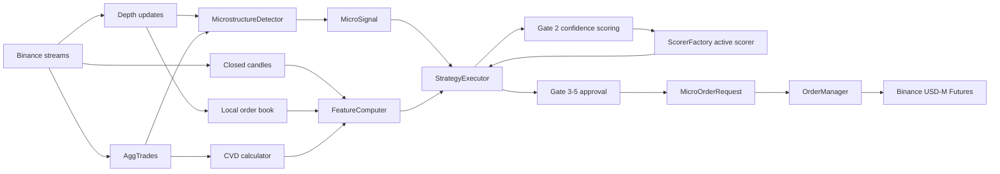
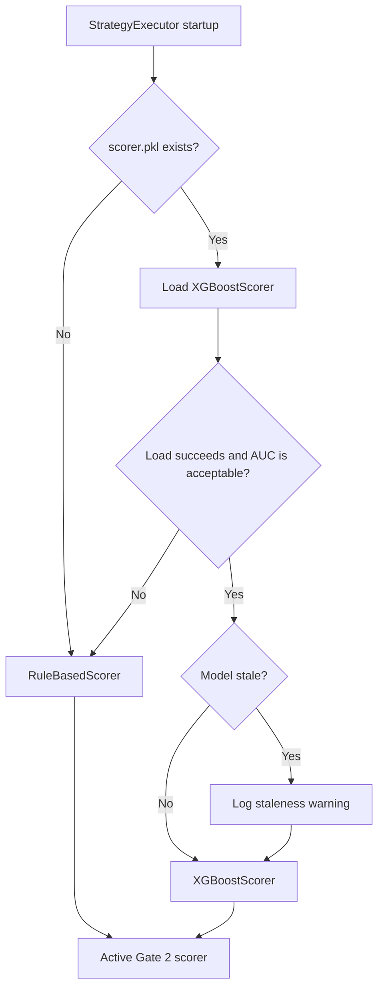
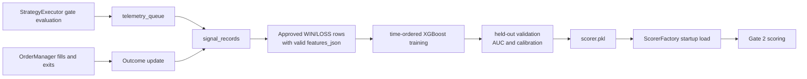

# Model Documentation

CryptoSentinel v3.1 uses its model layer as a confidence gate for microstructure signals. The model does not discover the primary trade setup. Wall identification, absorption, and sweep-with-protection logic create the candidate signal first; the model layer then decides whether the current market context is strong enough for that signal to continue through Gate 2.

This document reflects the current implementation. It intentionally describes the live code path as it exists now, including neutral default fields and training workflow gaps.

## Live Model Flow

The live microstructure path combines order book state, aggressive trade flow, and candle-derived context into one feature vector. `StrategyExecutor` computes that vector only after the signal has already passed data-fidelity and microstructure gates.

`RiskEngine` is instantiated for budget/tier state and tier synchronization; it is not between the microstructure `StrategyExecutor` and `OrderManager` — budget, exposure, and risk-tier checks happen inside `StrategyExecutor`. The legacy `MicrostructureEngine` (`engine/microstructure_engine.py`) is not started in the live `TaskGroup`.

## FeatureComputer Inputs

`FeatureComputer` is the shared feature builder used by live trading and replay/backtest paths. It maintains online state from three market-data streams and returns a `FeatureVector` when enough candle history is available.

| Input | Source | Role |
| --- | --- | --- |
| Closed candles | WebSocket candle stream / replay data | Updates VWAP, ATR, RSI, volume ratio, and candle-derived features. |
| LOB snapshots | Local order book / microstructure detector | Updates spread, mid price, OBI z-score, nearest-wall distance, and absorption ratio. |
| Wall metadata | Microstructure detector | Marks whether a wall is present and supplies wall reload/absorption context. |
| CVD calculator | AggTrade stream | Supplies recent CVD delta and directional CVD context at compute time. |
| Shared state | LOB engine and heartbeat monitor | Carries LOB status into the feature vector and supports Gate 0/Gate 2 telemetry. |

The feature computer is causal by design. Online statistics are scored against prior observations before being updated with the newest value, reducing look-ahead bias in live trading and replay.

`compute()` returns `None` until candle warm-up is complete. In the live executor, that produces a Gate 2 rejection with no full model feature snapshot.

## Feature Vector Schema

The model schema is the 15-field `FeatureVector`, serialized in the same order as `FEATURE_ORDER` in `strategy/scorer.py`.

| Feature | Meaning | Current source / caveat |
| --- | --- | --- |
| `price_vs_vwap` | Normalized distance between current close and VWAP | Computed from candle state and ATR-scaled normalization. |
| `obi_zscore` | Order book imbalance relative to prior OBI distribution | Computed from current book depth using Welford online statistics. |
| `cvd_delta` | Recent net aggressive-flow change | Read from the CVD calculator at feature computation time. |
| `vol_ratio` | Current candle volume relative to prior average volume | Computed causally from closed candles. |
| `atr_percentile` | Current ATR regime relative to prior ATR values | Computed with online percentile ranking. |
| `rsi_value` | Wilder RSI value | Requires candle warm-up before features are available. |
| `spread_bps` | Current bid/ask spread in basis points | Computed from best bid and best ask. |
| `pattern_r2` | Chart-pattern fit strength | Present in schema, but currently defaults to neutral in the micro executor. |
| `vwap_reclaim` | Whether price crossed back above VWAP | Computed from previous and current candle close. |
| `vol_climax` | Whether volume expansion is unusually high | Computed from `vol_ratio`. |
| `cvd_positive` | Directional CVD sign flag | Derived from `cvd_delta`. |
| `wall_detected` | Whether a tracked wall is present | Populated from current wall metadata. |
| `wall_distance_bps` | Distance from mid price to nearest tracked wall | Populated from current wall metadata. |
| `absorption_ratio` | Current wall quantity relative to initial wall quantity | Uses tracked wall reload ratio supplied to the feature computer. |
| `protection_wall_present` | Fresh protection-wall flag | Present in schema, but currently defaults to neutral in the micro executor. |

The schema already includes fields for chart-pattern and protection-wall context. Those fields are useful for model compatibility and future enrichment, but in the current microstructure executor they are not explicitly passed into `FeatureComputer.compute()`, so they use neutral defaults.

## Gate 2 Scoring

Gate 2 is the confidence gate inside `StrategyExecutor`. It runs after:

1. Gate 0 confirms that LOB and heartbeat state are acceptable.
2. Gate 1 confirms the signal is `SWEEP_WITH_PROTECTION` with a consumed wall, protection wall, and prior absorption.

Only then does the executor call `FeatureComputer.compute()`. If the feature vector is unavailable, usually because candle warm-up is incomplete, the signal is rejected at Gate 2 and no full `features_json` is recorded.

When feature computation succeeds, the executor:

- Scores the `FeatureVector` and `MicroSignal` with the active scorer.
- Records confidence, selected feature telemetry, LOB status, heartbeat status, and `features_json`.
- Applies the base confidence threshold and any risk-tier-elevated minimum confidence.
- Passes successful signals onward to capital, spread, latency, and rate-limit checks.

The scorer is therefore a filter on a valid microstructure setup, not the source of the setup itself.

## Scorer Architecture

`ScorerFactory` selects the active Gate 2 scorer at startup.

The preferred scorer is `XGBoostScorer`, loaded from `strategies/models/scorer.pkl`. Missing model files, load failures, and low-validation-quality model artifacts fall back to `RuleBasedScorer`. A stale model artifact logs a warning, but staleness alone does not force fallback.

`XGBoostScorer.score()` returns the model's estimated win probability for the current feature vector. An untrained scorer instance returns a neutral score rather than raising.

`RuleBasedScorer` is the current fallback. It conceptually rewards:

- OBI alignment with the signal direction.
- Volume expansion.
- Spread remaining within configured limits.

CVD remains in the feature vector and telemetry, but it is not a hard rule-based scoring component in the fallback scorer.

## Training Pipeline

Training data is collected through the same gate telemetry used for live diagnostics. All gate evaluations can be written to `signal_records`, but XGBoost training uses only the subset that is valid for supervised learning.

`XGBoostScorer.train_from_registry()` loads labeled rows from `strategies/registry.db`. Training rows must be:

- `gate_passed = 'APPROVED'`.
- `outcome` equal to `WIN` or `LOSS`.
- Non-empty `features_json`.
- Correct feature length for the current schema.
- Long enough in duration to avoid training on very short noise stops.

Rows are ordered by timestamp and split chronologically for training and validation. The training method rejects datasets with too few valid trades, single-class validation splits, or validation quality below the configured acceptance floor. Calibration error is logged so confidence values can be interpreted with appropriate caution.

After successful training, `XGBoostScorer.save()` writes a deployable artifact. On a later startup, `ScorerFactory` attempts to load that artifact and falls back to the rule-based scorer if the artifact is missing, invalid, or fails validation.

## Current Limitations

The model layer is operational as a confidence gate, but several parts are intentionally minimal in the current codebase:

- `pattern_r2` and `protection_wall_present` exist in the feature schema but currently default to neutral values in the microstructure executor unless passed explicitly.
- Training is implemented as `XGBoostScorer.train_from_registry()` rather than a dedicated CLI workflow.
- The trained scorer depends on enough approved, closed, labeled trades being present in `signal_records`.
- Gate 2 telemetry is only complete after feature computation succeeds; earlier gate rejects and warm-up rejects do not provide full `features_json`.
- The model does not replace the Wall/Absorption/Sweep signal design. It only scores whether an already valid microstructure signal should proceed.
