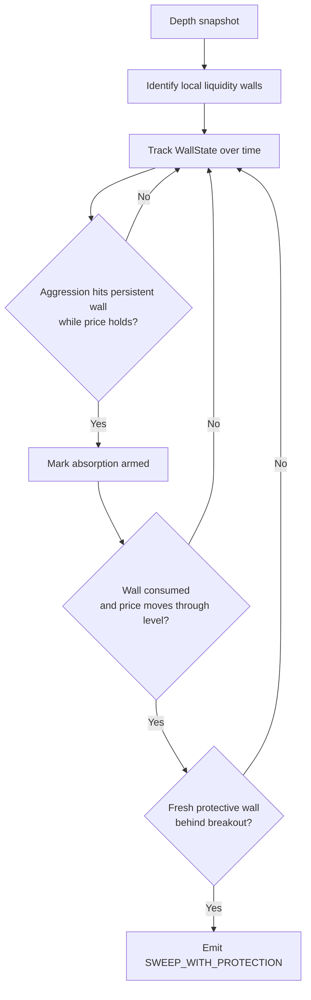
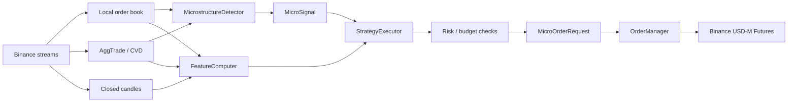
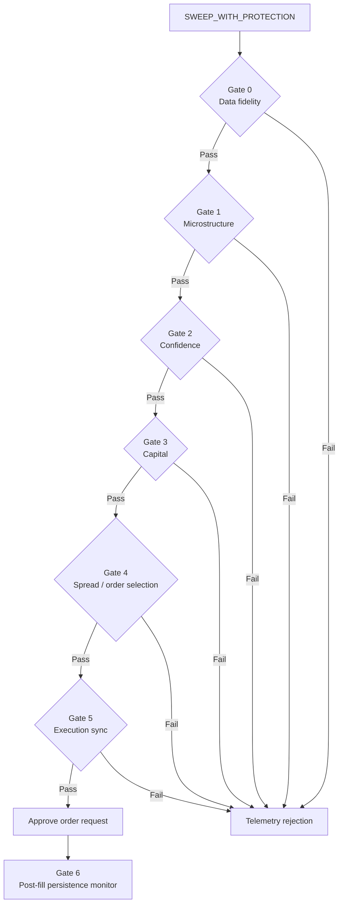

# Strategy Documentation

CryptoSentinel v3.1 is a level-specific market microstructure strategy for the BTCUSDT USD-M perpetual on Binance Futures. It is built around one core idea: price moves when aggressive order flow consumes persistent resting liquidity at specific order-book levels, and the highest-quality entries occur when that consumption is followed by fresh protective liquidity behind the breakout.

This document reflects the current project implementation. It should be treated as a living reference and updated as the strategy, model, and execution stack evolve.

## Strategy Thesis

The strategy does not trade generic order book imbalance by itself. OBI, CVD, volume, spread, VWAP, RSI, ATR, and chart-pattern context are used as confirmation or scoring inputs. The primary trigger is a granular sequence in the limit order book:

1. A significant liquidity wall is identified at a specific bid or ask level.
2. Aggressive flow hits that wall while price holds, indicating absorption.
3. The wall is later consumed, price moves through it, and a fresh wall appears behind the breakout as protection.
4. The resulting microstructure signal passes data, confidence, capital, spread, latency, and persistence gates before an order is submitted.

The strategy is intentionally conservative. Wall detection alone does not produce a trade, and absorption alone does not produce a trade. A trade requires a completed sweep plus fresh protective liquidity, then approval through the execution gate pipeline.

## Signal Design

### Liquidity Wall

A liquidity wall is a price level whose visible quantity is unusually large relative to nearby order-book levels on the same side of the book. The detector compares each level against its local neighborhood and flags levels that are statistically large outliers.

Bid walls represent unusually large resting buy liquidity below or near the market. Ask walls represent unusually large resting sell liquidity above or near the market.

Wall detection is a setup condition only. The system tracks each wall's initial quantity, current quantity, side, first-seen time, last-seen time, and reload ratio. This allows later logic to distinguish between persistent liquidity, refreshed liquidity, and consumed liquidity.

### Absorption

Absorption occurs when aggressive trades hit a persistent wall but price does not move meaningfully through it. In the current implementation:

- A bid wall absorbs seller aggression when sell pressure hits the bid but the level holds.
- An ask wall absorbs buyer aggression when buy pressure lifts the ask but the level holds.
- The wall must remain persistent and retain or reload a substantial portion of its original quantity.
- Price movement must remain below the price-move floor threshold (configurable via `MICRO_PRICE_MOVE_FLOOR_BPS`, default 0.03%). Note: the adaptive rolling-percentile threshold is used only for sweep detection, not for absorption.

Absorption does not trigger an entry. It arms the system by marking the wall as an important level where aggressive flow has already tested resting liquidity.

### Sweep With Protection

The executable signal is `SWEEP_WITH_PROTECTION`. It fires when a previously tracked wall is consumed, price moves in the sweep direction, and a fresh protective wall appears behind the breakout.

Direction is inferred from the side of the consumed wall:

| Consumed Wall | Implied Direction | Required Protection |
| --- | --- | --- |
| Ask wall consumed | Long | Fresh bid wall behind price |
| Bid wall consumed | Short | Fresh ask wall behind price |

The protection wall must be fresh, on the correct side of the book, close enough to the new mid price, and located behind the breakout. This requirement is designed to avoid chasing a sweep into empty liquidity.

## Entry Logic

The strategy enters only after the microstructure detector emits a valid `MicroSignal` and the `StrategyExecutor` approves it through the gate pipeline.

Current entry sequence:

1. `MicrostructureDetector` consumes reconstructed depth snapshots and aggregate trades.
2. It identifies and tracks liquidity walls.
3. It arms walls that show absorption.
4. It emits `SWEEP_WITH_PROTECTION` when a consumed wall, directional price movement, and fresh protection align.
5. `StrategyExecutor` evaluates the signal through the seven gates.
6. Approved signals become `MicroOrderRequest` objects.
7. The execution layer resolves the live limit price and submits an IOC-style aggressive limit order.

The signal-to-order path is event-driven and latency-sensitive. Signals that arrive too late, occur during stale LOB state, or appear when spreads are abnormal are rejected before order submission.

## Gate Rationale

The gate pipeline separates signal generation from trade approval. Each gate rejects a different failure mode and emits telemetry so both accepted and rejected signals can be analyzed later.

| Gate | Purpose | Rationale |
| --- | --- | --- |
| Gate 0: Data Fidelity | Confirms LOB sync and heartbeat health | Avoids trading on stale, disconnected, or degraded market data. |
| Gate 1: Microstructure | Confirms signal type, consumed wall, protection wall, and prior absorption | Ensures the trade is based on the intended wall-consumption pattern, not a partial setup. |
| Gate 2: Confidence | Scores the setup using the active scorer | Filters weak or contradictory setups before risking capital. |
| Gate 3: Capital | Checks daily budget, risk tier, and active exposure | Prevents overtrading, duplicate exposure, and entries during throttled risk states. |
| Gate 4: Order Selection | Requires spread to be within normal and configured limits | Avoids entering when transaction costs or liquidity conditions are unfavorable. |
| Gate 5: Execution Sync | Rejects stale signals and excessive latency | Keeps entries tied to the book state that generated the signal. |
| Gate 6: Persistence | Monitors the protection wall after fill | Exits or alerts when the post-entry liquidity premise disappears. |

## Confidence Scoring

Gate 2 uses the active scorer loaded by `ScorerFactory`.

When a trained model artifact is available and passes validation checks, the executor uses `XGBoostScorer`. The model scores the probability that an approved setup will be profitable based on the feature vector captured at signal time.

When no valid model is available, the system falls back to `RuleBasedScorer`. The fallback scorer conceptually rewards:

- OBI alignment with the trade direction.
- Volume expansion.
- Spread remaining within acceptable limits.

CVD is retained in the feature vector and telemetry. It contributes to model-based scoring and diagnostic analysis, but the current rule-based fallback does not use CVD as a hard entry gate.

## Feature Context

The strategy's primary edge comes from wall interaction, but every candidate signal is evaluated with broader market context from `FeatureComputer`.

Feature groups include:

| Group | Examples | Purpose |
| --- | --- | --- |
| Price location | Price vs VWAP, VWAP reclaim | Captures whether the sweep aligns with intraday price context. |
| Order book state | OBI z-score, spread, wall detected, wall distance | Measures book pressure and transaction-cost quality. |
| Aggressive flow | CVD delta, CVD direction | Captures taker-side pressure around the signal. |
| Volatility and volume | ATR percentile, volume ratio, volume climax | Avoids treating quiet and volatile regimes as equivalent. |
| Momentum | RSI | Adds compact candle-based momentum context. |
| Pattern context | Pattern fit score | Allows chart-pattern confirmation without making it mandatory. |
| Protection context | Absorption ratio, protection-wall presence | Connects model features back to the wall thesis. |

All online statistics are intended to be causal: features are scored against prior observations before being updated with the newest value. This reduces look-ahead bias in both live trading and replay.

## Trade Direction Examples

### Long Setup

1. A large ask wall appears above or near the market.
2. Buyer aggression repeatedly hits the ask wall, but price initially struggles to move through it.
3. The ask wall is consumed.
4. Mid price moves upward through the level.
5. A fresh bid wall appears behind the breakout.
6. The executor confirms data health, prior absorption, confidence, budget, spread, and latency.
7. A buy order request is emitted.

### Short Setup

1. A large bid wall appears below or near the market.
2. Seller aggression repeatedly hits the bid wall, but price initially holds.
3. The bid wall is consumed.
4. Mid price moves downward through the level.
5. A fresh ask wall appears behind the breakdown.
6. The executor confirms data health, prior absorption, confidence, budget, spread, and latency.
7. A sell order request is emitted.

## Risk And Execution Interface

The strategy layer does not directly place orders. It emits `MicroOrderRequest` objects after approval. These requests include:

- The original microstructure signal.
- The intended side, `BUY` for long and `SELL` for short.
- The selected order type.
- The confidence score.
- A notional risk hint derived from confidence and current risk tier.
- Fill and position-closed events used by post-entry monitoring.

The order manager handles live book-aware execution, fills, and protective order management. After a fill, Gate 6 watches the protection wall. If the protective liquidity disappears, spreads become unsafe, latency degrades, or max hold logic is reached, the monitor can trigger a safety exit through the order manager.

## Telemetry

Every evaluated signal produces telemetry. Rejected signals record the gate and reason for rejection. Approved signals store the feature vector, confidence, LOB status, heartbeat status, direction, and signal metadata.

This telemetry supports three feedback loops:

1. Debugging live behavior and confirming that gates reject for expected reasons.
2. Measuring the signal funnel from wall detection to approved order.
3. Building labeled training data for the XGBoost scorer after enough outcomes have been collected.

## Current Boundaries

The current strategy documentation covers the implemented wall, absorption, sweep, scorer, and gate logic. It does not yet document future changes such as minimum-quantity resting probe orders for cleaner wall-consumption detection. That idea remains a planned enhancement and should be added here once it is implemented or formally designed.

